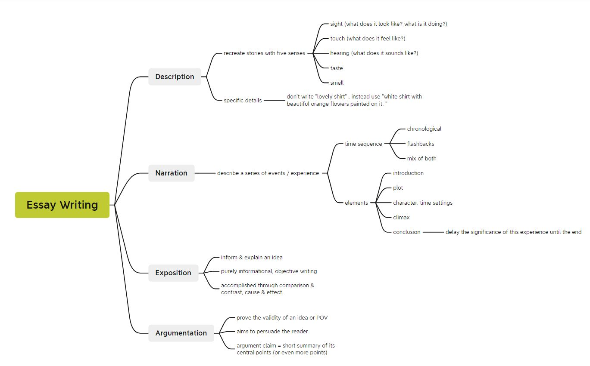

# 📝高级英语 期末考试

### **Part 1 口试**

**口试范围：**

- Audio/video clips from E-learning online assignment
- Book 5 -1B, 2B, 4A, 4B, 6A, 7A, 8A
- Book 6 - 1B, 2B, 3A, 3B, 4B


**口试方法：**

- 宣布了题目过后有3分钟看材料准备，然后2-3分钟的时间发表言论。


**口语例题**

```According to the text "Time Dollars" (Book 6 Chapter 2B), how does time dollars work and what are the advantages? Please analyze the potential problems with time dollars.```


------


### **Part 2 笔试**

**题型：**

- I) Listening comprehension (25%)
  - Section A: Two reports, MCQ Questions (10%)
  - Section B: Two interviews, MCQ Questions (10%)
  - Section C: Short answer questions (5%)
- II) Vocabulary, MCQ Questions (25%)
- III) Reading Comprehension, MCQ Questions (30%)
- IV) Essay Writing, 250 words (20%)


**Essay writing 历届考题**

2020:

 ```Online Learning vs Offline Learning ```

2021: 

```Consumerism is the theory that an increasing consumption of goods is economically beneficial while minimalism is about reducing consumption and believing that less is more. Which concept are you in support of?  ```





