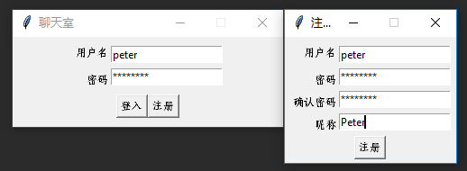
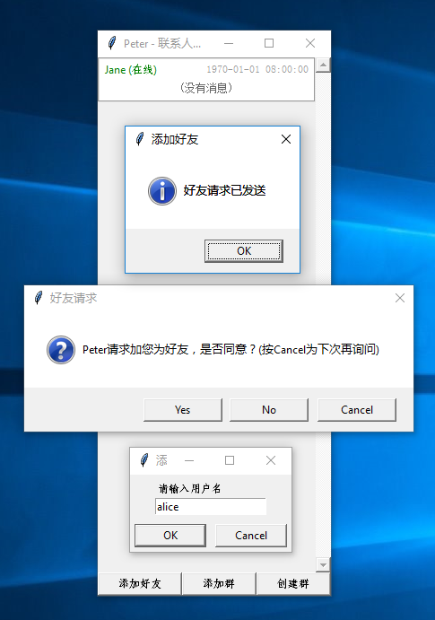
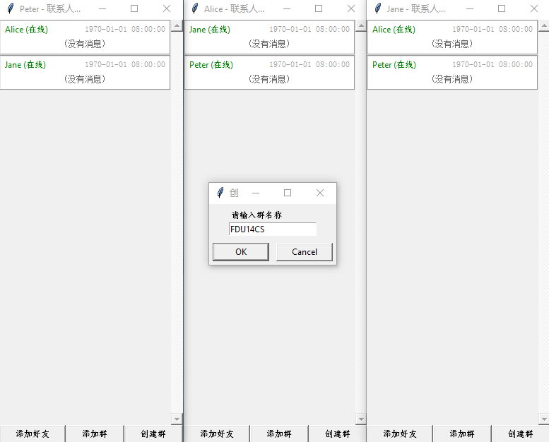
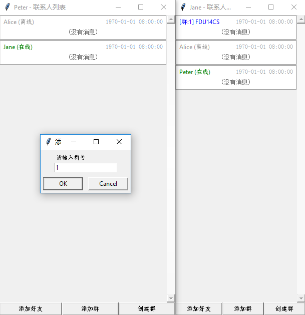
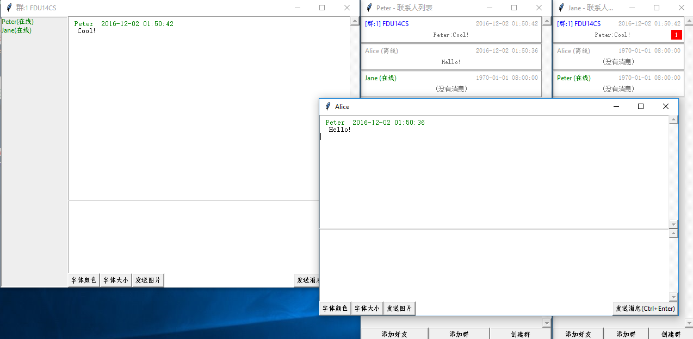
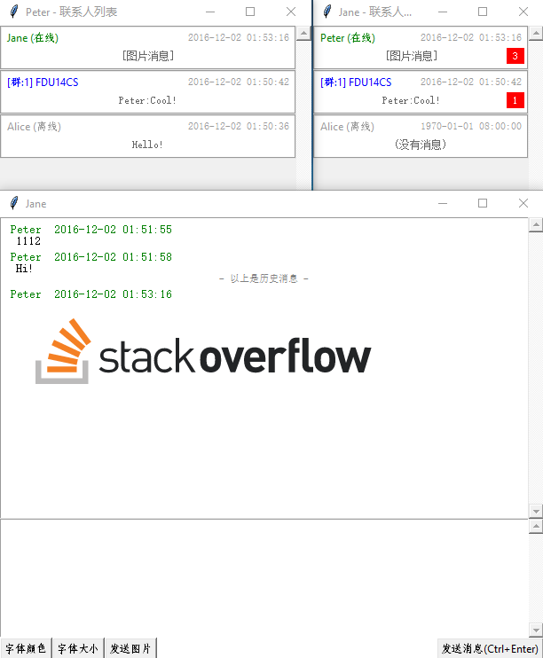
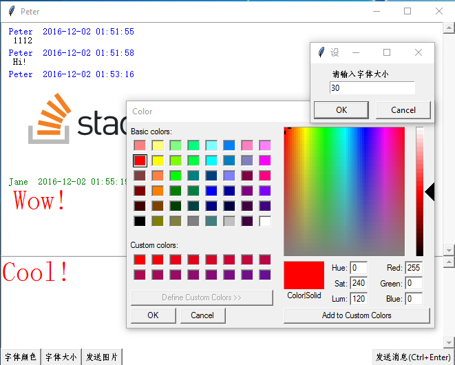
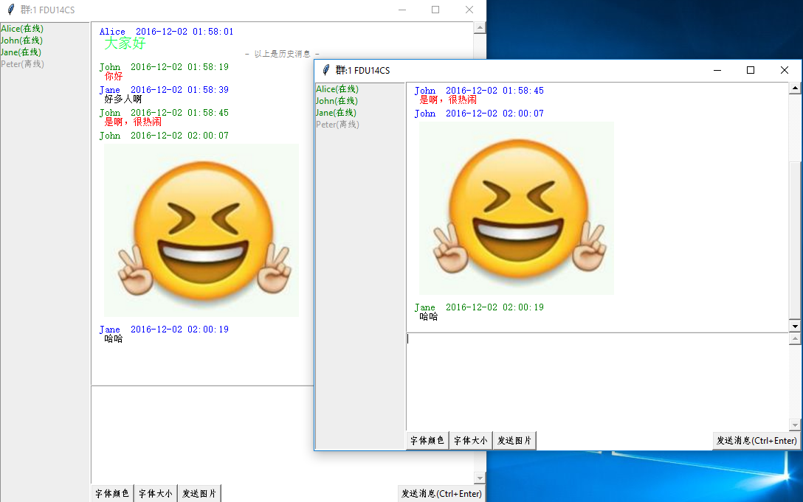
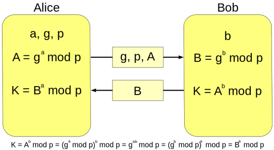

# 功能
- [x] Diffie-Hellman 密钥交换安全传输（启动时第一件事）
- [x] 用AES加密所有的传输内容
- [x] 包分为OpCode和Parameters，用binary序列化反序列化Parameters
- [x] 使用数据库存储用户信息、好友关系、房间信息、加入房间状态、所有聊天记录
- [x] tkinter GUI
- [x] 有新消息时自动滚动到底部
- [x] 窗口放大缩小
- [x] 服务器、客户端通过JSON文件配置
- [x] 联系人列表；按照最后发消息的时间排序好友和群；未读的消息用红点标注数量；显示并实时更新在线状态
- [x] 加好友功能，对方收到通知，通过/拒绝/推迟到下次登入时询问
- [x] 防止重复打开窗口，如果已经打开则使窗口获得焦点
- [x] 账号只能在一处登入，在别处登入时把原来登入的踢下线
- [x] 再次打开时恢复所有聊天记录、用户离线时收到的未读的消息用红点标注数量
- [x] 支持多行内容（Enter换行，Ctrl+Enter发送）；支持聊天字体的设置
- [x] 支持图片传输
- [x] 群聊功能、加群、创建群
- [x] 群聊中显示群成员（双击打开聊天窗口/发送好友请求）；实时显示群成员在线状态，置顶在线的成员
- [x] 智能的联系人列表中的最近消息（同QQ，群聊则显示发送者昵称，图片则显示[图片消息]，自动处理换行）

# 安装说明
Python版本: 3.5

```
pip install pycrypto # 用于AES加密
pip install Pillow # 支持JPG等格式图片的发送
```

也可以运行

```
pip install -r requirements.txt
```

# 运行方法
```
python run_client.py
python run_server.py
```
（一次只能运行一个server，但可以运行N个client）

# 配置文件
server和client共用```config.json```
```
{
  "crypto": {
    "base": ..,
    "modulus": ...
  },
  "client": {
    "server_ip": "127.0.0.1",
    "server_port": 8111
  },
  "server": {
    "bind_ip": "0.0.0.0",
    "bind_port": 8111
  }
}
```
大多都容易理解，需要注意的是```crypto```部分，这里的```base```和```modulus```是Diffie-Hellman密钥交换时用到的，应该为两个大素数。

# 文件目录
```
│  config.json
│  README.md
│  run_client.py
│  run_server.py
│
├─client
│  │  __init__.py
│  │
│  ├─components
│  │      contact_item.py
│  │      vertical_scrolled_frame.py
│  │      __init__.py
│  │
│  ├─forms
│  │      boilerplate.txt
│  │      chat_form.py
│  │      contacts_form.py
│  │      login_form.py
│  │      register_form.py
│  │      __init__.py
│  │
│  ├─memory
│  │      __init__.py
│  │
│  └─util
│      │  __init__.py
│      │
│      └─socket_listener
│              __init__.py
│
├─common
│  │  config.py
│  │  global_vars.py
│  │  __init__.py
│  │
│  ├─cryptography
│  │      crypt.py
│  │      prime.py
│  │      __init__.py
│  │
│  ├─message
│  │      __init__.py
│  │
│  ├─transmission
│  │      secure_channel.py
│  │      __init__.py
│  │
│  └─util
│          __init__.py
│
└─server
    │  database.db
    │  main.sql
    │  __init__.py
    │
    ├─broadcast
    │      __init__.py
    │
    ├─event_handler
    │      add_friend.py
    │      client_echo.py
    │      create_room.py
    │      join_room.py
    │      login.py
    │      query_room_users.py
    │      register.py
    │      resolve_friend_request.py
    │      send_message.py
    │      __init__.py
    │
    ├─memory
    │      __init__.py
    │
    └─util
        │  __init__.py
        │
        └─database
                __init__.py
```

# 预览图









# 自制聊天协议说明

本聊天协议受到HTTP协议启发

1. 无状态（除了登入操作之外）。
2. Request Body和Response Body使用键值对的方式，键为string，值可以为任意类型。

略作了修改

1. 登入时设置socket状态，后续传输不必再次说明身份。
2. 每个包头加入Request/Response Type，每个Type对应一种固定的操作，对应固定的参数列表。
3. 使用二进制而非类JSON方式传输，节省流量。

这种设计的优点

1. 简单易懂，易于测试（因为无状态）。
2. 灵活方便，无需为不同的操作类型写不同的处理程序。
3. 可以传输非常复杂的数据结构（如：登入时的所有N条未读消息（每条都含有发件人/时间/消息内容/甚至图片二进制）都是放在一个包里的）。

这种设计的缺点

1. 每个字段要指定一个key（如:user,pwd），每个value的类型要有一个byte指定，略浪费流量。

增加安全性，防止被窃听：

1. 自制的安全传输协议，在启动时会使用Diffie-Hellman算法与服务器交换密钥。
2. 交换完密钥后，所有的传输都会经过AES加密。
3. 客户端和服务器除了在协议上需要达到共识，不需要共享任何其他数据。
4. 在不安全的信道上，就算所有数据都被窃听，窃听者也无法解密消息内容。

缺点：

1. 无法防中间人攻击（没有做数字签名等）。



# 协议详细说明

*注：具体实现可以看```src/common/cryptography```、```src/common/transmission```和```src/common/message```*

协议设计的宗旨是：无状态、分层设计、以先发送长度再发送内容的方式设计。

网络包分为四层，前三层格式一致，第四层是值层，格式根据值类型不同而不同。构造分别如下：

## 层1（解密前）：

1. Length of Message Body (4Bytes) 
2. Length of AES padding (1Byte)  *AES加密填充用*
3. AES IV (16Bytes) *AES初始向量*
4. Message Body *被AES加密的内容*

## 层2（解密后）：

1. Message Type (4Bytes) *定义```MessageType```，见```src/common/message```*
2. Array of parameters.. *N个层3的数据*

## 层3（参数）：

1. Type of Parameter (1Byte) *定义```VAR_TYPE```，见```src/common/message```*
2. Length of Body (4 Bytes)
3. Body of Parameter *具体层4的数据，怎么解释需要根据```VAR_TYPE```决定，见层4*

## 层4（基础类型如int、str、bool、float、binary等）：

1. Packed Data (Using struct.pack in Python) *(直接转成bytes)*

## 层4（List）：

1. Array of Level 3 Data Pack *(N个层3的数据)*

## 层4（Dictionary）：

1. Length of Key (1 Byte) *Key的长度*
2. Key *Key的值（字符串）*
3. Level 3 Data Pack *层3数据作为Value的值*
4. Repeat.. *重复123*

一般来说，真正使用时，会选择直接发送一个List或者Dictionary作为层3，这样可以一次和服务器交换多个参数。

比如```self.sc.send(MessageType.login, [username, password])```

这种设计非常强大，结合```src/common/transmission```中的AES加密，可以无缝和服务器**安全**交换非常复杂的数据。比如，一个用户的所有离线未读消息（有N条，每条可能是不同的房间、不用的发送者，都包含不同的时间、字体大小，可能还有图片），可以通过一个包发送给客户端，效率非常高。

# 用SQLite存储用户信息和未读消息
数据库在```src/server/database.db```，结构如下：

```
CREATE TABLE "chat_history" (
"id"  INTEGER NOT NULL,
"user_id"  INTEGER,
"target_id"  INTEGER,
"target_type"  TEXT,
"data"  BLOB,
"sent"  INTEGER,
PRIMARY KEY ("id" ASC)
);

CREATE TABLE "friends" (
"from_user_id"  INTEGER NOT NULL,
"to_user_id"  INTEGER NOT NULL,
"accepted"  TEXT,
PRIMARY KEY ("from_user_id" ASC, "to_user_id")
);

CREATE TABLE "rooms" (
"id"  INTEGER NOT NULL,
"room_name"  TEXT,
PRIMARY KEY ("id")
);

CREATE TABLE "room_user" (
"id"  INTEGER NOT NULL,
"room_id"  INTEGER,
"user_id"  INTEGER,
PRIMARY KEY ("id")
);

CREATE TABLE "users" (
"id"  INTEGER NOT NULL,
"username"  TEXT,
"password"  TEXT,
"nickname"  TEXT,
PRIMARY KEY ("id" ASC)
);
```

比较有趣的是消息记录，这里直接用```BLOB```把```层2```的消息存下来。

现在我做的是消息记录全保存，就直接在服务器处理消息之前，把消息写入数据库，如果用户在线，```sent```设置为```True```，否则为```False```。

如果不希望保存所有消息，只希望保存未读消息，那么就去掉```sent```属性，只在用户不在线时写数据库，在用户在线后把数据读出来、发给用户然后删除即可。

# 两个有启发性的问题
## 大图传输失败？（数据包20KB以下不存在此问题）

	data = socket.recv(length_of_message)

第一感觉：接收```length_of_message```个字节，收满才继续执行程序。

真正含义：缓存区大小为```length_of_message```，接收一次数据！（缓存区满会继续，但继续不代表收满）

**TCP只保证数据到达先后顺序/不会漏也不会发重，但是不保证每次会到达多少数据！**

解决方法：

一定要在最先4个Bytes告知消息长度，然后用：

	while(bytes_received<bytes_total):
		data=socket.recv(bytes_total-bytes_received)
		bytes_received+=len(data)
		buffer+=data

对于select等非阻塞socket这个问题更加复杂一些，不过原理是相同的。

## Windows和Linux之间互发消息，消息无法解读。
Python在不同系统下long的长度不一样。

Python内存中字节序也不一样。

解决方法：

在打包时统一转换为“network byte order”，即big endian，long统一为32位。（可表示4GB长度，够用）

解码时解成自己系统相对应的，放入内存中。
